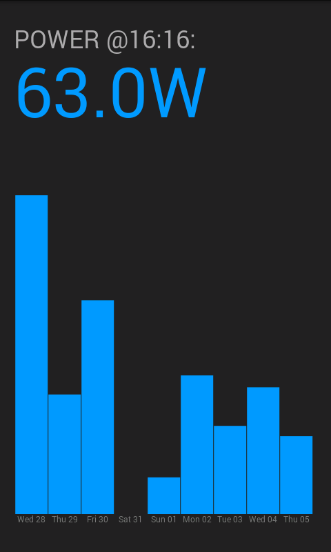

emoncms2
========

Small example of Processing to show emoncms data
@tingenek for llamas everywhere.

Unfinished afternoon's work.

1. Reads power every minute
2. Graph of last week's averages

ToDo:

1. Forgot to label graph.
2. URLs are hardcoded.
3. Little if any error handling.
4. Everything else I've forgotten.

